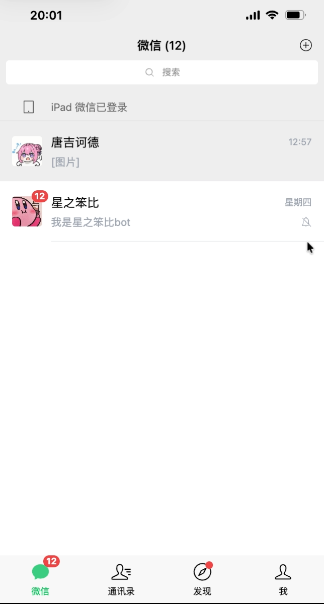
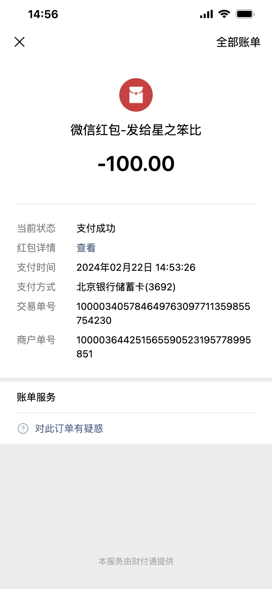

<h1 align="center">WeChat Online</h1>

<p align="center">
  一款高仿微信界面的在线模拟工具，所见即所得
</p>

<p align="center">
  <a href="https://github.com/caterpi11ar/wechat-online/stargazers">
    
  </a>
  <a href="https://github.com/caterpi11ar/wechat-online/network/members">
    
  </a>
  <a href="https://github.com/caterpi11ar/wechat-online/issues">
    
  </a>
  <a href="https://github.com/caterpi11ar/wechat-online/blob/main/LICENSE">
    
  </a>
  <a href="https://github.com/caterpi11ar/wechat-online">
    
  </a>
  <a href="https://github.com/caterpi11ar/wechat-online">
    
  </a>
</p>

<p align="center">
  <a href="https://wechat.caterpillar-soft.com/">在线预览</a>
  &nbsp;&middot;&nbsp;
  <a href="https://github.com/caterpi11ar/wechat-online/issues">报告 Bug</a>
  &nbsp;&middot;&nbsp;
  <a href="https://github.com/caterpi11ar/wechat-online/issues">提出新特性</a>
</p>

---

## 简介

复刻了微信的多种界面与功能，包括：

- 通讯录、对话（私聊 & 群聊）
- 发送各种类型的消息：文本、图片、转账、红包、消息引用、语音
- 发布 / 编辑朋友圈
- 钱包、交易记录
- …更多功能持续开发中

支持进入**编辑模式**进行所见即所得的修改，浏览器端可直接截图。

## 展示

<div align="center">
  
  
  
  
  
</div>

## 技术栈


## 快速开始

### 前置要求

- Node.js >= 18
- pnpm >= 9

### 安装 & 运行

```bash
# 克隆仓库
git clone https://github.com/caterpi11ar/wechat-online.git
cd wechat-online

# 安装依赖
pnpm install

# 启动开发服务器
pnpm run dev
```

### 构建

```bash
pnpm run build
```

## 贡献

欢迎任何形式的贡献！请先查看 [Issues](https://github.com/caterpi11ar/wechat-online/issues)，然后提交 Pull Request。

1. Fork 本仓库
2. 创建你的特性分支 (`git checkout -b feat/amazing-feature`)
3. 提交你的改动 (`git commit -m 'feat: add amazing feature'`)
4. 推送到分支 (`git push origin feat/amazing-feature`)
5. 发起 Pull Request

## 许可证

本项目基于 [GPL-3.0](./LICENSE) 许可证开源。

## Star History

<a href="https://star-history.com/#caterpi11ar/wechat-online&Date">
 <picture>
   <source media="(prefers-color-scheme: dark)" srcset="https://api.star-history.com/svg?repos=caterpi11ar/wechat-online&type=Date&theme=dark" />
   <source media="(prefers-color-scheme: light)" srcset="https://api.star-history.com/svg?repos=caterpi11ar/wechat-online&type=Date" />
   
 </picture>
</a>
